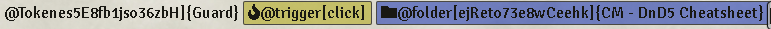
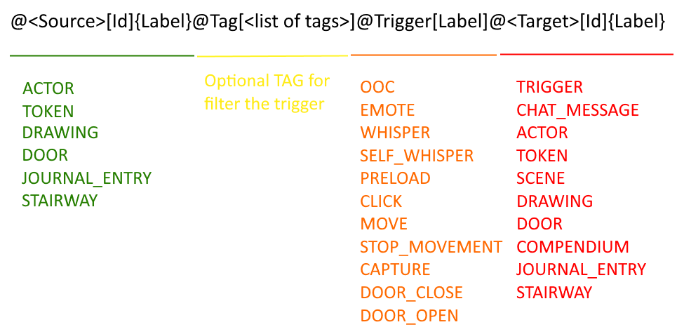

# Trigger Happy
# I have created a v10 compatible version of trigger happy. I will not be doing any further development on the module, other than bug fixes for v10.

# Tigger is happy is not followed anymore it's advisable to use [MATT (Monk Actvie Tile Trigger)](https://foundryvtt.com/packages/monks-active-tiles) instead


 

[](https://forge-vtt.com/bazaar#package=trigger-happy) 


[](https://www.foundryvtt-hub.com/package/trigger-happy/)

 

`Trigger Happy` is an FVTT module which adds a powerful yet simple system for creating triggers and automating things within a world.

This was created as a way of creating the interactive FVTT Tutorial on [The Forge](https://forgevtt.com/game/demo)

Open a journal entry under the folder named for 'Trigger Happy' edit the journal and insert in its content as text the trigger lines as described below.

# Installation

It's always easiest to install modules from the in game add-on browser.

To install this module manually:
1.  Inside the Foundry "Configuration and Setup" screen, click "Add-on Modules"
2.  Click "Install Module"
3.  In the "Manifest URL" field, paste the following url:

`https://raw.githubusercontent.com/League-of-Foundry-Developers/fvtt-module-trigger-happy/master/module.json`

4.  Click 'Install' and wait for installation to complete
5.  Don't forget to enable the module in game using the "Manage Module" button

# Known issue

- When you scale a placeable object the event (click, ecc.), are limited only to the original coordinates {x, y} and not the "scaled" image
- To remedy an incompatibility with other modules at the time of the 'mouse down' or other events together with the core setting 'Left-Click to Release Object' active, it is necessary that if a placeable object is selected on that event it remains at the event of 'mouse up' still selected. Unfortunately I have not found any other solution than to temporarily set the 'Left-Click to Release Object' setting to false (only if active) and then reset it to the original state at the 'mouse up' event. **You can enable/disable this 'patch' on the module setting 'Enable avoid to deselect elements on the trigger event' to true**
- Made the code more performant ...

# Module compatibility

- [Sound Link](https://github.com/superseva/sound-link) check out the examples
- [Forien Quest Log version 0.7.7 and later](https://github.com/League-of-Foundry-Developers/foundryvtt-forien-quest-log) check out the examples.
  - **NOTE:** _Just a note that on v9 document links are disabled. One of the last breaking changes to Foundry core for v9 required disabling the solution in place for day one compatibility. With the continuation / new quest log module on the horizon I'll be working out a full replacement / fix with the new module. `@Quest[<Quest ID>]{<name>}` will not work, but change that to `@JournalEntry[<Quest ID>{<name>}` should work._
- [Tagger](https://github.com/Haxxer/FoundryVTT-Tagger) check out the examples
- [Stairway](https://gitlab.com/SWW13/foundryvtt-stairways) (limited only to click event :( ) check out the examples
- [Shared Vision](https://github.com/CDeenen/SharedVision) added a integration feature check out the examples
- [NPC Chatter](https://github.com/cswendrowski/FoundryVtt-Npc-Chatter) check out the examples

# Settings

- **Name of the Trigger Folder on Note sidebar to use :** The name of the Trigger Folder on Note sidebar to use for listing triggers. The suggestion is to use one folder with this name. Default is 'Trigger Happy'
- **Name of the Trigger Journal to use :** The name of the journal entry to use for listing triggers. There can only be one. Refer to README file in module website for how to configure triggers. Default is 'Trigger Happy'
- **Enable triggers when running as GM**
- **Capture at edge of drawing/token**
- **Add enable/disable trigger happy button**
- **Enable tagger integration feature :** This feature need the tagger module installed and active, we filter the triggers only for the placeables object with one of the tag setted, the value is read like list of strings of tags separate from ',' e.g. 'tag1,tag2'. NOTE: you can avoid to enable this feature and just use @TAG on the journal, this is more for set some global tag to all the triggers
- **Enable 'journal for every scene' integration feature :** Sometime trigger are mixed up between scene and broke something, if this feature is enabled the module will try to find and parse only the journal starting with the same name (or id) of the current scene the clients are viewing. If no journal is found is rollback to standard mechanism and parse all the journals under the trigger folder. NOTE: if more scene have the same name the trigger are activated for all these scenes, if you really want you can avoid this specific issue by using the id of the scene
- **Enable 'only use journal for every scene' integration feature :** This setting make sense only with the setting 'journal for every scene' to true, it will disable the rollback to the standard parsing of the journals and make the parsing faster. ATTENTION: All the trigger on journals/notes that are not renamed based on a scene name/id will be ignored
- **Enable avoid to deselect elements on the trigger event :** To remedy an incompatibility with other modules at the time of the 'mouse down' or other events together with the core setting 'Left-Click to Release Object' active, it is necessary that if a placeable object is selected on that event it remains at the event of 'mouse up' still selected. Unfortunately I have not found any other solution than to temporarily set the 'Left-Click to Release Object' setting to false (only if active) and then reset it to the original state at the 'mouse up' event. YOU NEED A REFRESH OF THE PAGE FOR APPLY THIS"
- **If no token is found with that name try to found a token on the canvas linked to a actor with that id or name :** If no token is found with that name try to found a token on the canvas linked to a actor with that id or name, can be useful with some module like token mold where N tokens are linked to the same actor WORK ONLY `@Token` TRIGGERS.
- **Disable warning messages:** If checked this setting will disable all the warnings generate from the loading of the triggers. Is useful to let this disabled when you are developing your trigger.
- **Enable multiple trigger search:** If enabled this setting will registered not just the first, but all the trigger with the same name and id if they pass the filter, is enabled by default for retrocompatibility
- **Enable rendering of trigger with html on journal:** If enable will parse the syntax structure of the trigger and show a empty href html on the rendered sheet of the journal
- **Disable all trigger for hidden element:** If enabled this setting will disable by default all trigger for all placeable objects with the 'Toogle Visibility state' set to hidden/invisible like 'Token','Drawing',ecc. NOTE if on teh event link you have set explicity a `onlyIfHidden`, `onlyIfUnHidden` they have priority to this.

# Details

## Got a bunch of warnings like this '`Can't manage the config collection with entity 'XXX' and key 'YYY' on 'ZZZZ'`' and ' `Can't manage the config with entity 'XXX' and key 'YYY' on 'ZZZ'`' why ?

These messages like this '`Can't manage the config collection with entity 'drawing' and key 'Drawing'`' usually mean the trigger you are try to "get" (in this case a drawing) is not on the current scene/canvas. For example on the load of the scene _A_ i have a drawing with the label '_Arena_' then with this text i load a trigger.

`@drawing[Arena]@trigger[click]@scene[go to scene b]`

when i click on the drawing it's go to scene _B_, During the loading of the scene _B_ i got the  warning

`Can't manage the config collection with entity 'drawing' and key 'Drawing' on '@drawing[Arena]'`

and it should be fine,  it just a warning for let you know on this scene it was no possible to load that trigger.
For avoid the warning i have prepared these two additional setting :

- Enable 'journal for every scene' integration feature
- Enable 'only use journal for every scene' integration feature

they should help to make the warnings disappear and avoid to parse all the journals under the 'trigger happy' folder.

**NOTE: from the version 0.8.22 you can disable these warnings on the module setting 'Disable warning messages'**

## If your triggers mysteriously stop working check that you have not disabled them by mistake.

 

The laughing/crying face needs to be enabled or you can disable the face from the config settings.

## Video and Step by Step instructions

before we get into the details of how to use Trigger Happy, I think these links might be easier for people to get started quickly with using this module. Don't forget to come back and read the full README file to understand the full extent of how you can use Trigger Happy.

Here is a "Introduction to Trigger Happy" video tutorial by ['D&D Population Me'](https://patreon.com/dndpopulationme) : [https://www.youtube.com/watch?v=okTWYO4oEMA](https://www.youtube.com/watch?v=okTWYO4oEMA)

['D&D Population Me'](https://patreon.com/dndpopulationme) has also made two useful step by step guides for the most common use cases for using Trigger Happy :
- Token teleportation tutorial : [https://forums.forge-vtt.com/t/trigger-happy-teleportation-tutorial/2117/6](https://forums.forge-vtt.com/t/trigger-happy-teleportation-tutorial/2117/6)
- Scene Trap tutorial : [https://forums.forge-vtt.com/t/trigger-happy-traps/3448/4](https://forums.forge-vtt.com/t/trigger-happy-traps/3448/4)

Trigger Happy also comes with journal entries in its compendiums that gives useful examples of trigger scenarios you can use.

## Rendering html of the trigger, event-link, effect

From version 0.8.29 there is a new module setting disable by defualt  'Enable rendering of trigger with html on journal'.
If enabled now all the journals (and only these) under the Trigger Journal folder are render with a html code.


If there is some error on the syntax of the trigger the html is no rendered checkout the image below:



## How to use

To create triggers for a scene, it's very easy, create a journal entry with the title "Trigger Happy" (configurable in module settings) in which you will drag & drop actors, journals, macros, and anything else you want to trigger.

You can also create a Folder with the same "Trigger Happy" name and any journal entry inside that folder or in any of its own subfolders will be considered a trigger journal, so you can organize your trigger journals any way you want, when things start to get complex.

One line in the journal entry represents one trigger as long as the first link it contains is an Actor, a Token or a Scene. Any lines that do not have an actor or scene as their first link will be ignored, so feel free to organize your triggers however you see fit.

When a token that represents a trigger actor is clicked by a player, then any other links within that same line will be triggered. Macros will be executed, Scenes will be viewed, Roll tables will be rolled, Journal entries will be displayed and Tokens will be selected.

Here the example structure of the line of the journal:



**NOTE:** the trigger element MUST BE present on the current scene

**NOTE:** From version `0.8.22` the event link `@Trigger` is no more mandatory, if no event link with syntax `@Trigger` is specified the default one is `@Trigger[click]`

**NOTE:** From version `0.8.13` you can now use like id the character `*` for activate the same effect for all the trigger of that type the `{xxx}` label is just for you is not used form the general trigger.

Here a example:

#### When click on any journal on the scene the trigger open a specific one instead

`@JournalEntry[*]{Missioni}@Trigger[Click]@JournalEntry[bSsq0RnNTqp3YxUR]{Scorta al Lord}`

#### Every time you open a door on the scene the put the game on pause

`@Door[*]{Any string}@Trigger[DoorOpen]@Macro[pause_the_game]`

**NOTE:** From version `0.8.18-20` you can now use the triggers: `@ooc`, `@emote`, `@whisper`, `@selfwhisper` they have a specific syntax structure : `@XXX[content message]{alias|whisper|tokenId|actorId|sceneId}` all the parameter between `{}` are optional, but now you can customize a very specific chat message:

- alias: string of the alias if undefined get the user reference who start the trigger usually the GM
- whisper: array of string every string is a userId
- tokenId: string of the token id to set like chat speaker if undefined get the user reference who start the trigger usually the GM
- actorId: string of the actor id to set like chat speaker if undefined get the user reference who start the trigger usually the GM

| Key (case unsensitive) | Category  | Syntax structure (id, name, label are case unsensitive) | Description |
|:---------------:|:---------------:|:--------------:|:-----------:|
| `@Actor`        | Trigger,Effect  | `@Actor[id]{name}`, `@Actor[name]` | If used as a trigger, this will cause the triggers to activate on any token referenced by the actor with the specified name (you cannot set a token id in this case).  As a trigger effect, it will cause the player to render the sheet of the actor. |
| `@Token`        | Trigger,Effect  | `@Token[id]{name}`, `@Token[name]` | If used as a trigger, this will cause the triggers to activate on any token with the specified name (you cannot set a token id in this case). As a trigger effect, it will cause the player to render the sheet of the actor linked to the token. |
| `@Scene`        | Trigger,Effect  | `@Scene[id]{name}`  | As a trigger it laod the trigger effects during the load of the scene. As an effect it will redirect the player to the scene |
| `@Drawing`      | Trigger,Effect  | `@Drawing[id]{label}`, `@Drawing[label]` | This will trigger the effects when the player clicks/moves a token within the area of a drawing which has its text set to the `label` specified. Works best with rectangles. |
| `@Door`         | Trigger,Effect  | `@Door[coordinates]`,`@Door[*]@Tag[list pf tags]`| This will trigger the effects when a player opens or closes a door (based on options). The coordinates can be copy/pasted from the wall configuration sheet (excluding the `[` and `]`). Is best avoid coordinates and use the new tagger integration `@Door[*]@Tag[door01]` |
| `@JournalEntry` | Trigger,Effect  | `@JournalEntry[id]{name}`, `@JournalEntry[name]`  | If used as a trigger, this will cause the triggers to activate on any journal with the specified name (you cannot set a token id in this case). As a trigger effect |
| `@Stairway`     | Trigger,Effect  | `@Stairway[id]{name}`  | Integration with the [Stairway](https://gitlab.com/SWW13/foundryvtt-stairways) module, but is limited only to click event :(. As an effect, this will this will run some effects before the teleport of the stairway. **You need to install the module [Stairway](https://gitlab.com/SWW13/foundryvtt-stairways)**|
| `@ChatMessage`  | Effect          | `@ChatMessage[content message]{alias}`  | As an effect, this will send the specified message contents as a chat message |
| `@Compendium`   | Effect          | `@Compendium[packId.idCompendium.idItem]{label}`  | only useable as an effect will display the compendium entry. |
| `@Sound`        | Effect          | `@Sound[playlistName\|soundName]{label}`, `@Sound[playlistName\|soundName]`  | Integration with the [Sound Link](https://github.com/superseva/sound-link) module. As an effect, this will play a very specific sound. **You don't need to install the module [Sound Link](https://github.com/superseva/sound-link)**|
| `@Playlist`     | Effect          | `@Playlist[id]{name}`, `@Playlist[name]`  | As an effect, this will play a random sound from the specific playlist |
| `@ooc`          | Effect          | `@ooc[content message]{alias}`, `@ooc[content message]{alias\|whisper\|tokenId\|actorId\|sceneId}`  | As an effect, this will send the specified message contents as a chat message of type ooc|
| `@emote`        | Effect          | `@emote[content message]{alias}`, `@emote[content message]{alias\|whisper\|tokenId\|actorId\|sceneId}`  | As an effect, this will send the specified message contents as a chat message of type emote |
| `@whisper`      | Effect          | `@whisper[content message]{alias\|whisper}`, `@whisper[content message]{alias\|whisper\|tokenId\|actorId\|sceneId}`  | As an effect, this will send the specified message contents as a chat message of type whisper |
| `@selfwhisper`  | Effect          | `@selfwhisper[content message]{alias\|whisper}`, `@selfwhisper[content message]{alias\|whisper\|tokenId\|actorId\|sceneId}`  | As an effect, this will send the specified message contents as a chat message of type selfwhisper |
| `@Trigger`      | Event Link      | `@Trigger[option1 option2 option3]` | This applies modifiers on the trigger line, keep reading for more information about available options, read 'Advanced options' paragraph for more details |
| `@Tag`          | Event Link      | `@Tag[list of tags]`  | this element will activate the integration with the [Tagger](https://github.com/Haxxer/FoundryVTT-Tagger) module, will filter the trigger with a additional checking on the tags (if presents) on the object. **You need to install the module [Tagger](https://github.com/Haxxer/FoundryVTT-Tagger)** |
| `@<CONFIG[key]>`| Effect | `@Rolltable[id]{name}`, `@Quest[id]{name}`, `ecc.` | All keys colleciton supported from the `CONFIG` of foundry, the result maybe differ form what you expected depends on the specific use case |
| `@<CUSTOM[args]>`| Effect | `@XXX[args]`, `@YYY[args]`, `ecc.` | Read the details on 'Add a custom effect' paragraph |

## Details

- You can create and organize actors that would be used specifically for triggers, and drop them anywhere you want on the map. Using a transparent token has the best effect, and the players don't need to have any permissions for the token (or scene or journal to display) for the trigger to work.
- The triggers on actors and tokens will work only if they click on the token in the case of visible tokens, and if the token is hidden (GM layer), then it will activate the trigger when the player moves their token within the trigger token. Note that they can always do a long move and jump over the token which would not trigger the effects.
- Don't forget that you can also use token avatars as buttons, or change their width and height to fit your need.
- If multiple trigger effects are in the same line, then they will be executed in sequence, waiting for the previous effect to finish before starting the next one.
- IMPORTANT: if the module setting 'Enable multiple trigger search' is checked you can registered multiple Triggers with the same name on the same line, usually is not advaisable becuase you can encounter strange behavior and don't know why the solution integration with the Tagger module is prederable. You can't invoke multiple effect with the same name only the first one is invoked, e.g. `@Rolltable[pippo]` will get only the first rolltable with name 'pippo', you can invoke two times the same effect anyway e.g. `@Rolltable[pippo]@Rolltable[pippo]`


## Add a custom Effect

Now you can add your custom effect to the trigger, the element between the characters `[` and `]` is "read" like a array of arguments separate from the whitespace character ` `, so you can customized your entry like you want. The custom effect is invoked with a hook using the key (without @) like a reference. Remember the check is case unsensitive so `@XXX` and `@xxx` are "read" like the same custom effect during the registration.
from this trigger:

`@Token[Pippo]@XXX[arg1 arg2]@YYY[arg3 arg4]`

when the token  with name 'Pippo' is clicked the module will invoked these hooks:

`Hooks.call('TriggerHappy', 'XXX', [arg1 arg2])`

`Hooks.call('TriggerHappy', 'YYY', [arg3 arg4])`

so in your code you must implement something like this:
```
Hooks.on('TriggerHappy', (key, args) => {
    // 'key' is the reference name of the custom effect without the initial @
    // 'args' is the array of string to use like arguments for your code
})
```

**Modules and macros MUST register the custom effect with the `registerEffect` function during the setup of foundry.**
For example:

```
Hooks.once('setup', function () {
  game.triggers.registerEffect('XXX');
  game.triggers.registerEffect('YYY');
});
```

**NOTE: You can override if you want a default effect (is not advisable but you can), here a example :**

```
Hooks.once('setup', function () {
  game.triggers.registerEffect('Quest');
  game.triggers.registerEffect('Rolltable');
});
```

## Advanced options for Event Link

You can customize the behavior a little using the `@Trigger` pseudo link which allows you to set options.

**NOTE : all the option are case unsensitive for the module**

The following options are available :

- `ooc`: Will send any chat messages in that trigger as an out of character message
- `emote`: Will send any chat messages in that trigger as an emote
- `whisper`: Will send any chat messages in that trigger as a whisper to the GM
- `selfWhisper`: Will send any chat messages in that trigger as a whisper to the player who activates the trigger
- `preload`: Will cause any scene on the trigger line to be preloaded instead of switching the view to it
- `click`: Will cause the trigger token to activate on a click. **THIS IS THE DEFAULT VALUE**
- `move`: Will cause the trigger token to activate on a token move over it
- `stopMovement`: Will prevent any tokens from moving on top of the trigger token
- `capture`: Will cause the trigger token to capture any player moment that crosses it
- `doorClose`: Will cause a `@Door` trigger to trigger when the door is closed instead of the default when it opens.
- `doorOpen`: Will cause a `@Door` trigger to trigger when the door is open. This is the default, but it can be used along with 
- `doorClose` option to have it trigger on both open and close
- `onlyIfHidden` by default the trigger is activate for all placeable objects 'hidden' and 'unhidden' with this argument you are telling to the trigger to activate only if the placeable object is hidden (support for now only the element with the 'Toogle Visibility state' option like 'Token','Drawing',ecc. for other case you can use the @Tag for manage your special case)
- `onlyIfUnHidden` by default the trigger is activate for all placeable objects 'hidden' and 'unhidden' with this argument you are telling to the trigger to activate only if the placeable object is unhidden (support for now only the element with the 'Toogle Visibility state' option like 'Token','Drawing',ecc. for other case you can use the @Tag for manage your special case)

If a token is hidden (GM layer), then it is automatically considered a 'move' trigger, otherwise it's a 'click' trigger. You can override it with the `@Trigger[click]` or `@Trigger[move]` options, or you can specify both options to make a token trigger on both clicks and moves.

Contrarily to the `@Trigger[move]` triggers, which only activate when a token ends its movement on their, the `@Trigger[capture]` will trigger when a token crosses its path, which can be very useful to setting up a trap that the players cannot jump over. When a `capture` trigger is activated, the token movement will be stoped and the token will be moved to the center of the trigger. The token can only be moved out of the `capture` trigger if its starting position is the center of the trigger.

The above example used the `@Actor[name]` format for simplicity, but when drag&dropping actors, they would appear in the journal entry as `@Actor[id]{name}`.

By using a `Token` trigger, you can have a single actor for your triggers (a door, a button or a transparent image) but setting a different and unique name for your tokens would allow you to use them as different triggers, without duplicating actors all over your actors directory.

By using the `ChatMessage` effect, you can send any message to chat. When used in combination with [Advanced Macros](https://github.com/League-of-Foundry-Developers/fvtt-advanced-macros), you can use it to trigger macros with arguments specific to your trigger. Previously The Furnace was suggested, but that is now out of data and Advanced Macros provides the identical functionality.

You can also use the format `@ChatMessage[message contents]{speaker name alias}`

## Examples from the community add your own by open a issue `^_^`

#### Traps in Dungeon Room 37

```
@Actor[Transparent actor above trap #1] @JournalEntry[You have triggered a trap]
@Actor[Transparent actor above trap #2] @JournalEntry[You have triggered a trap]
```

#### Teleport the PC if they touch the magic circle, I warned them not to approach that room anyway, so it's their fault if they do

```
@Actor[Magical Circle] @Scene[Prison Cell] @JournalEntry[You are teleported] @RollTable[Magical side effect from teleportation] @Macro[Spawn token at position 100,200]
```

#### Move the players to the next scene when they open the door to the basement

```
@Actor[Transparent token on door tile] @Scene[The basement]
```


#### Display a dialog with the latest rumors the PCs hear when they enter the tavern, and show them the lcoal prices

```
@Scene[Tavern] @Macro[Display Dialog about rumors] @JournalEntry[Tavern room prices]
```

#### The next 100 lines could create a complex sequence of triggers that automate the entire game so the DM's job is obsolete

```
@JournalEntry[nREvRbeH8O4Fsngp]{Missioni}@Tag[test01]@Trigger[Click]@JournalEntry[bSsq0RnNTqp3YxUR]{Scorta al Lord}@RollTable[3pzl8ZBGWf9gp8II]{Catharina Combat}@Compendium[SupersHomebrewPack.classes.AH3dUnrFxZHDvY2o]{Bard}@ChatMessage[sdgfgfgf]{Gamemaster}@Sound[Test|Medieval_Fantasy City Under Attack audio atmosphere]{Attack}@Quest[nJRQV2mtlqygfmVe]{New Quest}
```
same but starting from a stairway

```
@Stairway[sw-43ayfc0q]{Vai di Sopra}@Trigger[Click]@JournalEntry[bSsq0RnNTqp3YxUR]{Scorta al Lord}@RollTable[3pzl8ZBGWf9gp8II]{Catharina Combat}@Compendium[SupersHomebrewPack.classes.AH3dUnrFxZHDvY2o]{Bard}@ChatMessage[sdgfgfgf]{Gamemaster}@Sound[Test|Medieval_Fantasy City Under Attack audio atmosphere]{Attack}@Quest[nJRQV2mtlqygfmVe]{New Quest}
```

#### As an example : 

```
@Token[unique token name] @ChatMessage[Stop right there!]{Guard} @ChatMessage[/pan 1500 1500 0.3]

@Scene[World Map] @Token[Party Marker]
```

#### When the player enters the scene, preload the next one

```
@Scene[Dungeon level 1] @Scene[Dungeon level 2] @Trigger[preload]
```

#### When they click on the stairs, move them to the preloaded scene and select a token

```
@Token[Lvl 1 bottom stairs] @Scene[Dungeon level 2] @Token[a specific token they can control]
```

#### Prevent the player from jumping into the bonfire like a moron

```
@Token[Bonfire] @ChatMessage[Your friends stop you from jumping into the fire, that can be dangerous]{GM} @Trigger[move stopMovement ooc]
```

But let them touch it

```
@Token[Bonfire] @Trigger[click] @ChatMessage[You burn your hand slightly]{GM}
```

#### If they click or try to move through the chasm, say something, but let them jump over it

```
@Token[hole in bridge over the chasm] @ChatMessage[The drop looks like 1000 feet]{Chasm} @Trigger[move click stopMovement ooc]
```

```
@Token[hole in bridge over the chasm] @ChatMessage[is scared] @Trigger[emote]
```

#### When token is clicked start a sound

```
@Token[Bonfire] @Trigger[click] @ChatMessage[You burn your hand slightly]{GM}
```

I have a macro that play a sound, i call it "SonaX", you can name it at your will:

```
AudioHelper.play({src: args[0], volume: 1, autoplay: true, loop: false}, true);
```

Then, in Trigger Happy you can invoque taht macro and give the url to the sound. For example:

```
@Token[trap] @Trigger[capture move] @ChatMessage[/SonaX "Audios/cadenes.mp3"]
```

or if you want some random sound from playlist

```
const playlistName = args[0];
const soundName = args[1];
const toggle = args[2];
const startsWith = args[3];
if (!game.user.isGM) return;

const playlist = game.playlists.entities.find(p => startsWith ? p.name.startsWith(playlistName) : p.name === playlistName);
if (!playlist) return ui.notifications.warn('Playlist ${playlistName} was not found.');

let sound = null;
if(soundName){
    sound = playlist.sounds.find(s => startsWith ? s.name.startsWith(soundName) : s.name === soundName);
}else{
    sound = playlist.sounds.roll().results[0]
}
if (!sound) return ui.notifications.warn('Sound ${soundName} in playlist ${playlist.name} was not found.');

playlist.updateEmbeddedEntity("PlaylistSound", {_id: sound._id, playing: toggle == null ? !sound.playing : toggle});
```

and

```
@Token[tokenname]@Trigger[move]@ChatMessage[/SonaX "Playlist Name" "Track Name"]
```


#### When they click on the journal, a chat message in rendered

```
@JournalEntry[TEST] @Trigger[click] @ChatMessage[You burn your hand slightly]
```

#### When they click on the journal, open another journal instead ??

```
@JournalEntry[TEST] @Trigger[click] @JournalEntry[TEST 2]
```

#### New Forien Quest Log support with the new 0.7.7 version and the ID Quest mechanism

here the video on the exact minute: https://youtu.be/lfSYJXVQAcE?t=586

```
@JournalEntry[TEST] @Trigger[click] @Quest[xXj5KZlMvGn3pTX8]{New Quest}
```

**NOTE:** _Just a note that on v9 document links are disabled. One of the last breaking changes to Foundry core for v9 required disabling the solution in place for day one compatibility. With the continuation / new quest log module on the horizon I'll be working out a full replacement / fix with the new module. `@Quest[<Quest ID>]{<name>}` will not work, but change that to `@JournalEntry[<Quest ID>{<name>}` should work._

### Example with [NPC Chatter](https://github.com/cswendrowski/FoundryVtt-Npc-Chatter) module base on this [video](https://www.youtube.com/watch?v=W6z0pMUBAz8)

Here the trigger i put on the journal:

`@Token[Catharina Combat]@Trigger[Click]@Macro[eD2rpXMTXTuo7Bh2]{Catharina Merchant Chatter}`

and here the macro with name 'Catharina Merchant Chatter' (you can do a better macro it' just a example):

```
var NAME = "Catharina Combat";
var token = game.scenes.filter(x => x.active)[0].data.tokens.filter(x => {
// console.error(x.name);
if(x.name.toLowerCase().includes(NAME.toLowerCase().trim())){
  return x;
}
})[0];
// console.log(token.name);
game.npcChatter.tokenChatter(token);
```

remember to create  a rolltable with name 'Catharina Combat'

## [Changelog](./changelog.md)

## Issues

Any issues, bugs, or feature requests are always welcome to be reported directly to the [Issue Tracker](https://github.com/League-of-Foundry-Developers/fvtt-module-trigger-happy/issues ), or using the [Bug Reporter Module](https://foundryvtt.com/packages/bug-reporter/).

## License

This Foundry VTT module, writen by KaKaRoTo, is licensed under a [Creative Commons Attribution 4.0 International License](http://creativecommons.org/licenses/by/4.0/) and the [Foundry Virtual Tabletop Limited License Agreement for module development](https://foundryvtt.com/article/license/).

- [Font Awesome Free 5.15.4 by @fontawesome](https://fontawesome.com) with [License (Icons: CC BY 4.0, Fonts: SIL OFL 1.1, Code: MIT License)](https://fontawesome.com/license/free)
